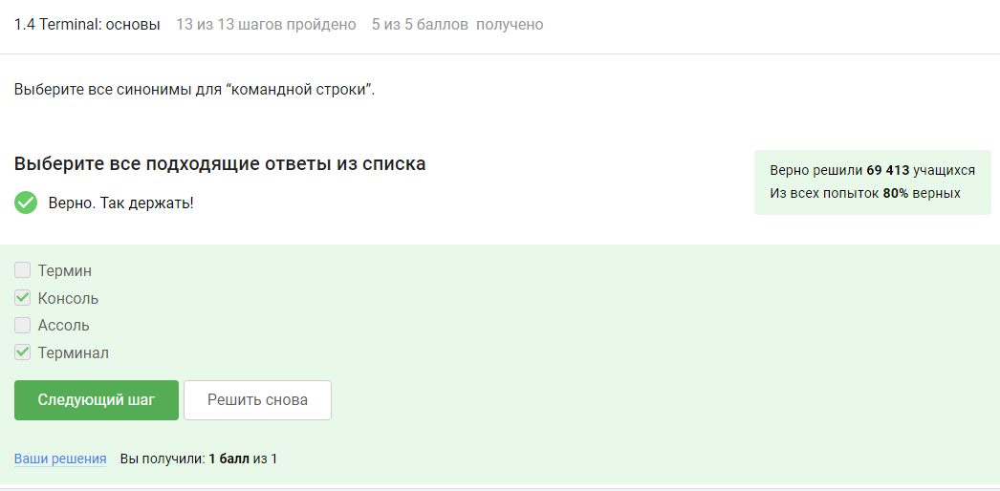

---
## Front matter
title: "Отчет о прохождении 1 раздела внешнего курса"
subtitle: "Введение"
author: "Собко Александр Дмитриевич, НКАбд-02-23"

## Generic otions
lang: ru-RU
toc-title: "Содержание"

## Bibliography
bibliography: bib/cite.bib
csl: pandoc/csl/gost-r-7-0-5-2008-numeric.csl

## Pdf output format
toc: true # Table of contents
toc-depth: 2
lof: true # List of figures
lot: true # List of tables
fontsize: 12pt
linestretch: 1.5
papersize: a4
documentclass: scrreprt
## I18n polyglossia
polyglossia-lang:
  name: russian
  options:
	- spelling=modern
	- babelshorthands=true
polyglossia-otherlangs:
  name: english
## I18n babel
babel-lang: russian
babel-otherlangs: english
## Fonts
mainfont: PT Serif
romanfont: PT Serif
sansfont: PT Sans
monofont: PT Mono
mainfontoptions: Ligatures=TeX
romanfontoptions: Ligatures=TeX
sansfontoptions: Ligatures=TeX,Scale=MatchLowercase
monofontoptions: Scale=MatchLowercase,Scale=0.9
## Biblatex
biblatex: true
biblio-style: "gost-numeric"
biblatexoptions:
  - parentracker=true
  - backend=biber
  - hyperref=auto
  - language=auto
  - autolang=other*
  - citestyle=gost-numeric
## Pandoc-crossref LaTeX customization
figureTitle: "Рис."
tableTitle: "Таблица"
listingTitle: "Листинг"
lofTitle: "Список иллюстраций"
lotTitle: "Список таблиц"
lolTitle: "Листинги"
## Misc options
indent: true
header-includes:
  - \usepackage{indentfirst}
  - \usepackage{float} # keep figures where there are in the text
  - \floatplacement{figure}{H} # keep figures where there are in the text
---

# Цель работы

Ознакомиться с функционалом операционной системы Linux.

# Задание

Просмотреть видео и на основе полученной информации пройти тестовые задания.

# Теоретическое введение

Линукс - в части случаев GNU/Linux — семейство Unix-подобных операционных систем на базе ядра Linux, включающих тот или иной набор утилит и программ проекта GNU, и, возможно, другие компоненты. Как и ядро Linux, системы на его основе, как правило, создаются и распространяются в соответствии с моделью разработки свободного и открытого программного обеспечения. Linux-системы распространяются в основном бесплатно в виде различных дистрибутивов — в форме, готовой для установки и удобной для сопровождения и обновлений, — и имеющих свой набор системных и прикладных компонентов, как свободных, так и проприетарных. 

# Выполнение лабораторной работы

1 Этап: (рис. @fig:001, @fig:002, @fig:003, @fig:004, @fig:005, @fig:006, @fig:007, @fig:008, @fig:009, @fig:010, @fig:011, @fig:012, @fig:013, @fig:014, @fig:015, @fig:016, @fig:017, @fig:018, @fig:019, @fig:020, @fig:021, @fig:022, @fig:023, @fig:024, @fig:025, @fig:026, @fig:027, @fig:028, @fig:029, @fig:030, @fig:031).

{#fig:001 width=70%}

Название курса

{#fig:002 width=70%}

Критерии

{#fig:003 width=70%}

У меня на основном пк windows и на ноутбуке linux

{#fig:004 width=70%}

Очевидно

{#fig:005 width=70%}

Да

{#fig:006 width=70%}

Создал документ и прикрепил его

{#fig:007 width=70%}

deb

{#fig:008 width=70%}

{#fig:009 width=70%}

Установив программу, смотрим имя автора

{#fig:010 width=70%}

Менеджер обновлений — это программа для обновления установленного программного обеспечения в дистрибутивах ОС Linux, основанных на Debian или использующих систему управления пакетами APT. Менеджер обновлений устанавливает обновления безопасности или просто улучшающие функциональность программы.

{#fig:011 width=70%}

Просто смотрим видео и отвечаем

{#fig:012 width=70%}

Регистрозависимость.

{#fig:013 width=70%}

all инструкция нам не подходит

{#fig:014 width=70%}

полный путь, также выходим наверх на одну ступень, затем спускаемся в Загрузки

{#fig:015 width=70%}

rm -r удаление директории и рекуррентное удаление файлов, находящихся в ней.

{#fig:016 width=70%}

Просто проверил на ноутбуке

{#fig:017 width=70%}

Запуск в фоновом режиме

{#fig:018 width=70%}

{#fig:019 width=70%}

Скриншот с результатом выполнение (время немного отличается, потому что сначала сделал задание, потом отчет)

{#fig:020 width=70%}

Автоматически поток ошибок выводится на экран

{#fig:021 width=70%}

2 - поток ошибок. Одна и две стрелки - перенаправление вывода в нашем случае в файл

{#fig:022 width=70%}

cat names.txt | ./interacter.py | less

Вывод на экран

{#fig:023 width=70%}

флаг -O перемещает файл в текущую директорию, тк не указана другая и по ключу 1.jpg меняет его название

{#fig:024 width=70%}

-q
--quiet
    Turn off Wget's output. 

из мануала

{#fig:025 width=70%}

Руководствовался информацией из лекции курса

{#fig:026 width=70%}

действительно удаляет

{#fig:027 width=70%}

gzip не имеет возможности создавать архив

{#fig:028 width=70%}

c - архиватор

j - bz2

f - потому что создаем архив в файловой системе

{#fig:029 width=70%}

регистры, вопрос это один символ, расширение jpg а не jpeg

{#fig:030 width=70%}

регистрозависимость, пропуск буквы l

{#fig:031 width=70%}

`grep -r "love" ~/Shakespeare/ > 1_m.txt`

# Выводы

Посмотрев курс, я узнал немного нового, но освежил в голове старые знания и попрактиковал навыки

# Список литературы{.unnumbered}
