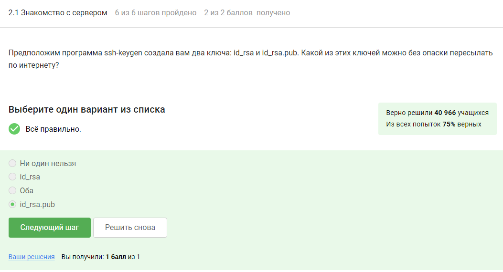
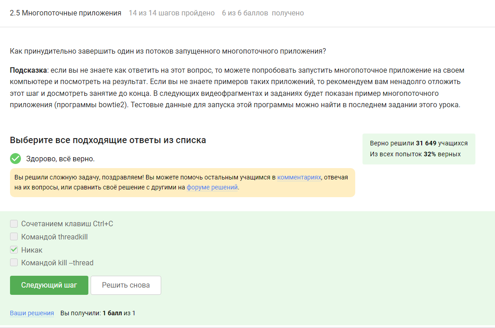

---
## Front matter
title: "Отчет о прохождении 2 раздела внешнего курса"
subtitle: "Работа на сервере"
author: "Собко Александр Дмитриевич, НКАбд-02-23"

## Generic otions
lang: ru-RU
toc-title: "Содержание"

## Bibliography
bibliography: bib/cite.bib
csl: pandoc/csl/gost-r-7-0-5-2008-numeric.csl

## Pdf output format
toc: true # Table of contents
toc-depth: 2
lof: true # List of figures
lot: true # List of tables
fontsize: 12pt
linestretch: 1.5
papersize: a4
documentclass: scrreprt
## I18n polyglossia
polyglossia-lang:
  name: russian
  options:
	- spelling=modern
	- babelshorthands=true
polyglossia-otherlangs:
  name: english
## I18n babel
babel-lang: russian
babel-otherlangs: english
## Fonts
mainfont: PT Serif
romanfont: PT Serif
sansfont: PT Sans
monofont: PT Mono
mainfontoptions: Ligatures=TeX
romanfontoptions: Ligatures=TeX
sansfontoptions: Ligatures=TeX,Scale=MatchLowercase
monofontoptions: Scale=MatchLowercase,Scale=0.9
## Biblatex
biblatex: true
biblio-style: "gost-numeric"
biblatexoptions:
  - parentracker=true
  - backend=biber
  - hyperref=auto
  - language=auto
  - autolang=other*
  - citestyle=gost-numeric
## Pandoc-crossref LaTeX customization
figureTitle: "Рис."
tableTitle: "Таблица"
listingTitle: "Листинг"
lofTitle: "Список иллюстраций"
lotTitle: "Список таблиц"
lolTitle: "Листинги"
## Misc options
indent: true
header-includes:
  - \usepackage{indentfirst}
  - \usepackage{float} # keep figures where there are in the text
  - \floatplacement{figure}{H} # keep figures where there are in the text
---

# Цель работы

Ознакомиться с функционалом операционной системы Linux.

# Задание

Просмотреть видео и на основе полученной информации пройти тестовые задания.

# Теоретическое введение

Линукс - в части случаев GNU/Linux — семейство Unix-подобных операционных систем на базе ядра Linux, включающих тот или иной набор утилит и программ проекта GNU, и, возможно, другие компоненты. Как и ядро Linux, системы на его основе, как правило, создаются и распространяются в соответствии с моделью разработки свободного и открытого программного обеспечения. Linux-системы распространяются в основном бесплатно в виде различных дистрибутивов — в форме, готовой для установки и удобной для сопровождения и обновлений, — и имеющих свой набор системных и прикладных компонентов, как свободных, так и проприетарных. 

# Выполнение лабораторной работы

2 Этап: (рис. @fig:001, @fig:002, @fig:003, @fig:004, @fig:005, @fig:006, @fig:007, @fig:008, @fig:009, @fig:010, @fig:011, @fig:012, @fig:013, @fig:014, @fig:015, @fig:016, @fig:017, @fig:018, @fig:019, @fig:020, @fig:021, @fig:022, @fig:023, @fig:024).

{#fig:001 width=70%}

По сути это дистанционный компьютер, его можно использовать вообще для всех задач

{#fig:002 width=70%}

id_rsa.pub = публичный ключ

{#fig:003 width=70%}

-r как флаг для рекурсивного копирования команды scp (secure copy)

{#fig:004 width=70%}

Проверка интернет соединения - узнать, есть ли у нас вообще доступ к хранилищу с кодом программы 
sudo apt-get update для обновления пакетов

{#fig:005 width=70%}

FileZilla — свободный многоязычный проект, посвящённый приложениям для FTP. Включает в себя отдельное приложение «FileZilla Client», и «FileZilla Server».

{#fig:006 width=70%}

Вроде все очевидно


{#fig:007 width=70%}

Стандартные варианты

{#fig:008 width=70%}

FastQC supports files in the following formats

FastQ (all quality encoding variants)
Casava FastQ files*
Colorspace FastQ
GZip compressed FastQ
SAM
BAM
SAM/BAM Mapped only (normally used for colorspace data)


{#fig:009 width=70%}

-align
Do full multiple alignment.


{#fig:010 width=70%}

С - убивает процесс
Z - приостанавливает процесс

{#fig:011 width=70%}


{#fig:012 width=70%}

9 KILL (non-catchable, non-ignorable kill)


{#fig:013 width=70%}

Команда kill шлёт сигнал о завершении процесса, который будет обработан после продолжения процесса

{#fig:014 width=70%}

Остановленная программа не потребляет ресурсы

{#fig:015 width=70%}

Приостановленный процесс не убивается, а поэтому продолжает занимать место в памяти

{#fig:016 width=70%}

{#fig:017 width=70%}

 bowtie2 --help | grep threads
 -p/--threads <int> number of alignment threads to launch (1)

{#fig:018 width=70%}

```
echo "306174 reads; of these:
  306174 (100.00%) were unpaired; of these:
    11 (0.00%) aligned 0 times
    305580 (99.81%) aligned exactly 1 time
    583 (0.19%) aligned >1 times
100.00% overall alignment rate" > bowtie.log

```

{#fig:019 width=70%}

Логично, он ведь остановлен

{#fig:020 width=70%}

exit завершает работу tmux

{#fig:021 width=70%}

Вы ведь не остановили tmux

{#fig:022 width=70%}

Вкладка сразу не закроется. Tmux предварительно спросит "kill -pane 0?"

{#fig:023 width=70%}

Ctrl+b , - переименовать текущее окно;

{#fig:024 width=70%}

Проверил каждый пункт на ноутбуке

# Выводы

Я просмотрел курс и освежил в памяти навыки работы с процессами и другими командами в Линукс.

# Список литературы{.unnumbered}

